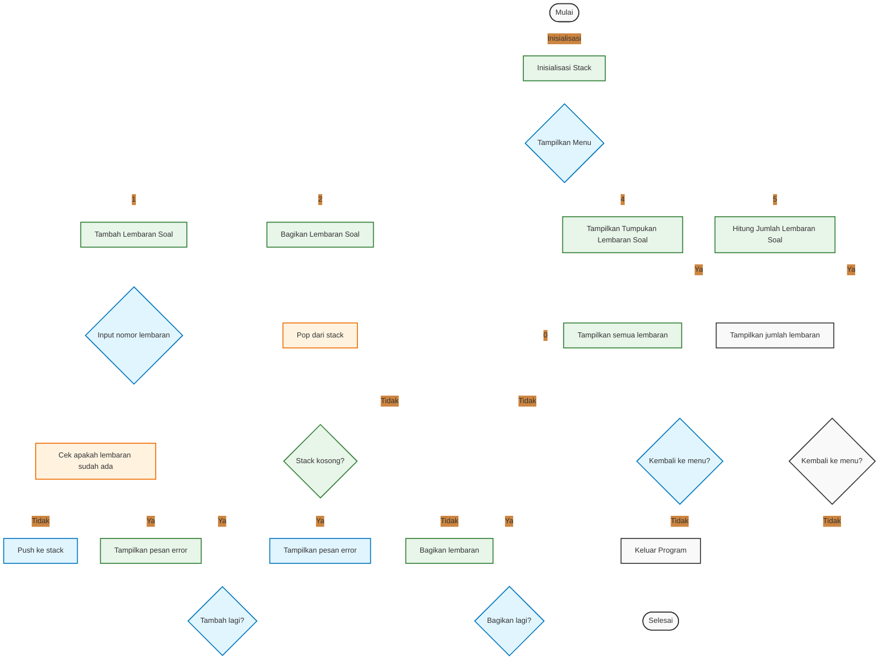

```mermaid
%%{init: {
  'theme': 'base',
  'themeVariables': {
    'primaryColor': '#8B4513',
    'secondaryColor': '#556B2F',
    'tertiaryColor': '#A0522D',
    'mainBkg': '#DEB887',
    'secondBkg': '#D2B48C',
    'lineColor': '#FFFFFF',
    'textColor': '#FFFFFF',
    'edgeLabelBackground':'#CD853F'
  }
}}%%
graph TD
    A([Mulai]) -->|Inisialisasi| B[Inisialisasi Stack]
    B --> C{Tampilkan Menu}
    C -->|1| D[Tambah Lembaran Soal]
    C -->|2| E[Bagikan Lembaran Soal]
    C -->|4| F[Tampilkan Tumpukan Lembaran Soal]
    C -->|5| G[Hitung Jumlah Lembaran Soal]
    C -->|0| H[Keluar Program]
    
    D --> I{Input nomor lembaran}
    I --> J[Cek apakah lembaran sudah ada]
    J -->|Ya| K[Tampilkan pesan error]
    J -->|Tidak| L[Push ke stack]
    L --> M{Tambah lagi?}
    M -->|Ya| I
    M -->|Tidak| C
    
    E --> N[Pop dari stack]
    N --> O{Stack kosong?}
    O -->|Ya| P[Tampilkan pesan error]
    O -->|Tidak| Q[Bagikan lembaran]
    Q --> R{Bagikan lagi?}
    R -->|Ya| N
    R -->|Tidak| C
    
    F --> S[Tampilkan semua lembaran]
    S --> T{Kembali ke menu?}
    T -->|Ya| C
    T -->|Tidak| H
    
    G --> U[Tampilkan jumlah lembaran]
    U --> V{Kembali ke menu?}
    V -->|Ya| C
    V -->|Tidak| H
    
    H --> W([Selesai])

   classDef default fill:#f9f9f9,stroke:#333,stroke-width:2px;
    classDef decision fill:#e1f5fe,stroke:#0277bd,stroke-width:2px;
    classDef process fill:#e8f5e9,stroke:#2e7d32,stroke-width:2px;
    classDef io fill:#fff3e0,stroke:#ef6c00,stroke-width:2px;
    
    class A,U default;
    class C,I,L,M,P,R,T decision;
    class B,D,E,F,G,K,O,Q,S process;
    class J,N io;
```